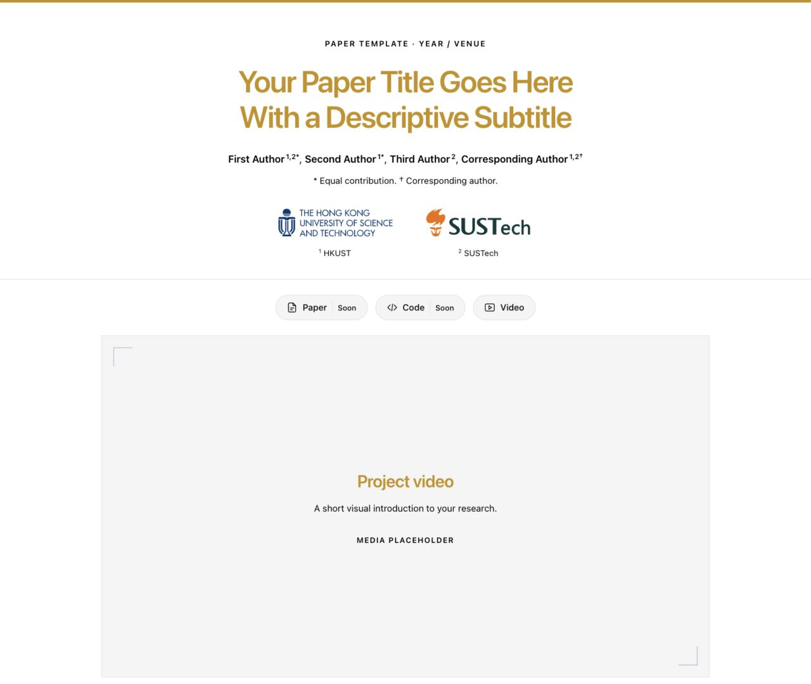
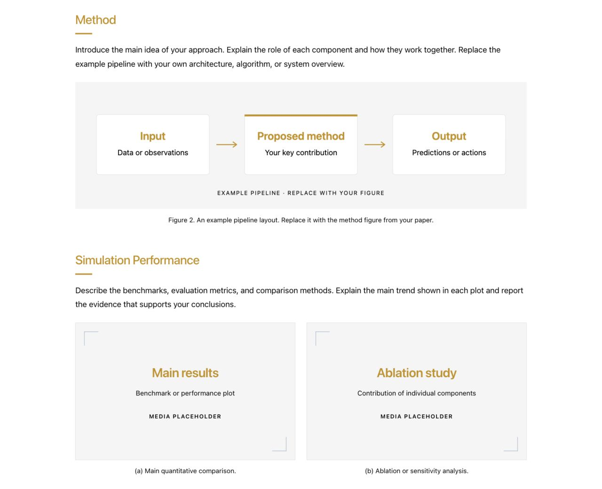
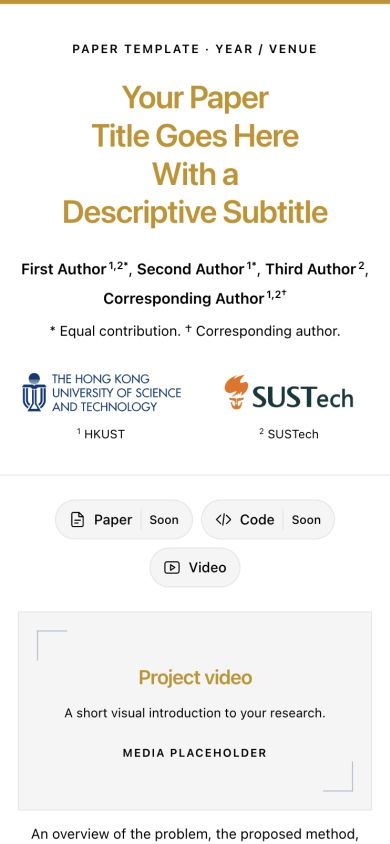

# Paper Website Template

一个简洁的论文项目网页模板，采用金色标题、黑色正文与系统字体，搭配 HKUST 与 SUSTech 标志。

| 正文与实验结果 | 手机效果 |
| --- | --- |
|  |  |

摘要、方法、实验、图视频与 BibTeX，组成一张完整的论文项目页。支持手机浏览、引用复制与下载，纯静态、无依赖。

修改 [paper.config.mjs](paper.config.mjs)，运行 `node scripts/build.mjs` 即可替换为自己的论文。详细配置与发布说明见 [AGENTS.md](AGENTS.md)。

版式参考 [Rapid Embodiment Adaptation](https://embodiment-adaptation.github.io/) · [素材来源](docs/ASSETS.md) · [MIT License](LICENSE)
